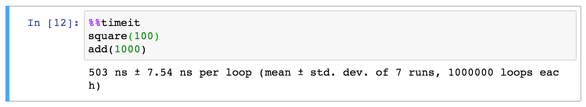

####   强大的多维度数组与矩阵计算库


#### 一、 Jupyter Notebook环境

##### IPython

IPython 是一个基于Python的交互式解释器，提供了强大的编辑和交互功能，比默认的python shell 好用得多，支持变量自动补全，自动缩进，支持 bash shell 命令，内置了许多很有用的功能和函数。

IPython 是基于BSD 开源的。

IPython 为交互式计算提供了一个丰富的架构，包含：

- 强大的交互式 shell
- Jupyter 内核
- 交互式的数据可视化工具
- 灵活、可嵌入的解释器
- 易于使用，高性能的并行计算工具

##### Anaconda

Anaconda (官网:https://www.anaconda.com/)，中文大蟒蛇，是一个开源的Python发行版本，Anaconda包括Conda、Python以及一大堆安装好的工具包，比如：numpy、pandas等, 是数据分析,机器学习过程中常用的库. 

Anaconda包含了Jupyter Notebook编辑器和IPython解释器, 我们可以在Jupyter Notebook中使用IPython解释器编写代码.

Anaconda具有如下特点：

- 开源

- 安装过程简单

- 高性能使用Python和R语言

- 免费的社区支持

其特点的实现主要基于Anaconda拥有的：

- conda包

- 环境管理器

- 1,000+开源库

##### anaconda安装

进入**Anaconda官网** :https://www.anaconda.com/, 下载最新版Anaconda


安装过程: 

1. 右击，以管理员方式运行
2. 点击 next

3. 点击 I Agree (同意)
4. 选择All Users, 点击 next
5. 选择安装路径, 点击 next
6. **两个都勾选(忽略红色警告)**，点击install
7. 等待安装完成后, 点击 next
8. 不安装VSCode, 点击Skip
9. 取消勾选, 点击Finish完成安装

##### anconda运行

1. 点击windows电脑左下角开始 > 搜索Anaconda > 点击Anaconda Prompt

   

2. 在弹出的窗口中输入想进入的目录(cd Desktop) > 再输入jupyter notebook命令启动

   

3. 启动成功后, 会自动弹出浏览器

   )

4.  接下来就可以在浏览器中写代码了

##### Jupyter Notebook使用

Jupyter Notebook（此前被称为 IPython notebook）是一个交互式笔记本，支持运行 40 多种编程语言。

Jupyter Notebook 的本质是一个 Web 应用程序，便于创建和共享文学化程序文档，支持实时代码，数学方程，可视化和markdown。 用途包括：数据清理和转换，数值模拟，统计建模，机器学习等等 。

Jupyter notebook：集文本、代码、图像、公式的展现于一体的超级python web界面

###### Jupyter Notebook 有两种键盘输入模式

- 编辑模式: 允许你往单元中键入代码或文本；这时的单元框线是绿色的。 

  

- 命令模式: 键盘输入运行程序命令；这时的单元框线为蓝色。

  

###### 常用快捷键:

命令模式 (按键 Esc 开启): 

- Shift + Enter : 运行本单元，选中下个单元
- Ctrl + Enter : 运行本单元
- Alt + Enter : 运行本单元，在其下插入新单元
- Y : 单元转入代码状态
- M :单元转入markdown状态

- A : 在上方插入新单元
- B : 在下方插入新单元
- DD : 删除选中的单元

编辑模式 ( Enter 键启动): 

- Tab : 代码补全或缩进
- Shift + Tab : 提示
- Shift-Enter : 运行本单元，选中下一单元  
- Ctrl-Enter : 运行本单元
- Alt-Enter : 运行本单元，在下面插入一单元

##### IPython的帮助文档

###### 使用help()

  通过以下命令来获得帮助文档, 查看len函数的文档：

)

##### 使用?

 还可以应用到自定义的变量和自定义的函数上来返回帮助文档

)

此外，使用两个??可以把函数的源代码显示出来

)

###### tab自动补全

  输入包名,模块名,函数名,变量名时可以使用tab键补全 

###### shift + tab  查看参数和函数说明

)

##### IPython魔法命令

###### 运行外部Python文件: %run

使用下面命令运行外部python文件（默认是当前目录，其他目录可以加上绝对路径）

**myscript.py**

```python
def square(x):
    """square a number"""
    return x ** 2

for N in range(1, 4):
    print(N, "squared is", square(N))
```

尤其要注意的是，当我们使用魔法命令执行了一个外部文件时，该文件的函数就能在当前会话中使用

我们可以通过下面命令执行它: 


###### 运行计时: %time


###### 平均运行时间: %timeit


###### 多行代码的平均运行时间: %%timeit



###### 执行Linux/windows指令: !


###### 更多魔法命令(了解): lsmagic

列出所有魔法命令: lsmagic


#### 二、NumPy

##### 课程介绍

NumPy（Numerical Python）是Python的一种开源的数值计算扩展。提供多维数组对象，各种派生对象（如掩码数组和矩阵），这种工具可用来存储和处理大型矩阵，比Python自身的嵌套列表（nested list structure)结构要高效的多（该结构也可以用来表示矩阵（matrix）），支持大量的维度数组与矩阵运算，此外也针对数组运算提供大量的数学函数库，包括数学、逻辑、形状操作、排序、选择、输入输出、离散傅立叶变换、基本线性代数，基本统计运算和随机模拟等等。

- 几乎所有从事Python工作的数据分析师都利用NumPy的强大功能。
  - 强大的N维数组
  - 成熟的广播功能
  - 用于整合C/C++和Fortran代码的工具包
  - NumPy提供了全面实用的线性代数、傅里叶变换和随机数生成函数等功能
  - 极快的运算速度
  - NumPy和稀疏矩阵运算包scipy配合使用更加强大

- 安装NumPy库 

  - Anaconda自带NumPy库 


##### 课程内容

###### 导入numpy库

```python
# 数据分析 “三剑客”
import numpy as np
import pandas as pd
import matplotlib.pyplot as plt
```

##### 一、创建ndarray

###### 1. 使用np.array()由python list创建

- 参数为列表： [1, 4, 2, 5, 3]

注意：

- numpy默认ndarray的所有元素的类型是相同的
- 如果传进来的列表中包含不同的类型，则统一为同一类型，优先级：str>float>int
- ndarray的数据类型：

  - int:   int8、uint8、int16、int32、int64
  - float:   float16、float32、float64
  - str:  字符串

```Python
list1 = [1,2,3,4,5,6]
n = np.array(list1)
n
# 输出:
# array([1, 2, 3, 4, 5, 6])

type(n)
# 输出:
# numpy.ndarray

# 显示多个结果
display(n, type(n))

# 元素类型优先级： str > float > int
n = np.array([3.14, 2, 1, 5])
n
# 输出:
# array([3.14, 2.  , 1.  , 5.  ])

n = np.array(["hello", 1, 2, 3.14])
n
# 输出:
# array(['hello', '1', '2', '3.14'], dtype='<U5')
```

###### 2. 使用np的常规函数创建

包含以下常见创建方法：

###### 1) np.ones(shape, dtype=None, order='C')

- 创建一个所有元素都为1的多维数组

参数说明:

- shape : 形状
- dtype=None: 元素类型

- order ： {‘C’，‘F’}，可选，默认值：C 是否在内存中以行主（C-风格）或列主（Fortran-风格）顺序存储多维数据, 一般默认即可

  ```python
  # 创建一个所有元素都为1的多维数组
  n = np.ones(5)
  n
  # 输出:
  # array([1., 1., 1., 1., 1.])
  
  n = np.ones((3, 4), dtype=np.int)  # 整数,3行4列
  n
  # 输出:
  # array([[1, 1, 1, 1],
  #        [1, 1, 1, 1],
  #        [1, 1, 1, 1]])
  ```

###### 2) np.zeros(shape, dtype=float, order='C')

- 创建一个所有元素都为1的多维数组

参数说明:

- shape : 形状

- dtype=None: 元素类型

  ```python
  # 创建一个所有元素都为0的多维数组
  n = np.zeros((5,5), dtype=np.int)
  n
  # 输出
  # array([[0, 0, 0, 0, 0],
  #       [0, 0, 0, 0, 0],
  #       [0, 0, 0, 0, 0],
  #       [0, 0, 0, 0, 0],
  #       [0, 0, 0, 0, 0]])
  ```

###### 3) np.full(shape, fill_value, dtype=None, order='C')

- 创建一个所有元素都为指定元素的多维数组

参数说明:

- shape: 形状

- fill_value: 填充值

- dtype=None: 元素类型

  ```python
  # 创建一个所有元素都为0的多维数组
  n = np.full((2,3,4), 8)
  n
  # 输出
  # array([[0, 0, 0, 0, 0],
  #       [0, 0, 0, 0, 0],
  #       [0, 0, 0, 0, 0],
  #       [0, 0, 0, 0, 0],
  #       [0, 0, 0, 0, 0]])
  ```

###### 4) np.eye(N, M=None, k=0, dtype=float)

- 对角线为1其他的位置为0的二维数组

参数说明:

- N: 行数

- M: 列数, 默认为None,表示和行数一样

- k=0: 向右偏移0个位置

- dtype=None: 元素类型

  ```python
  # 对角线为1其他的位置为0
  n = np.eye(6, 6, dtype=int)
  n
  # 输出
  # array([[1, 0, 0, 0, 0, 0],
  #       [0, 1, 0, 0, 0, 0],
  #       [0, 0, 1, 0, 0, 0],
  #       [0, 0, 0, 1, 0, 0],
  #       [0, 0, 0, 0, 1, 0],
  #       [0, 0, 0, 0, 0, 1]])
  
  # 右偏移2个位置
  n = np.eye(6,6, k=2, dtype=int)
  # 左偏移2个位置
  n = np.eye(6,6, k=-2, dtype=int)
  n
  # 输出
  # array([[0, 0, 0, 0, 0, 0],
  #       [0, 0, 0, 0, 0, 0],
  #       [1, 0, 0, 0, 0, 0],
  #       [0, 1, 0, 0, 0, 0],
  #       [0, 0, 1, 0, 0, 0],
  #       [0, 0, 0, 1, 0, 0]])
  ```

###### 5) np.linspace(start, stop, num=50, endpoint=True, retstep=False, dtype=None)

- 创建一个等差数列

参数说明:

- start: 开始值

- stop: 结束值

- num=50: 等差数列中默认有50个数

- endpoint=True: 是否包含结束值

- retstep=False: 是否返回等差值(步长)

- dtype=None: 元素类型

  ```python
  # 创建一个等差数列
  n = np.linspace(0, 100, dtype=np.int)
  n
  # 输出
  # array([  0,   2,   4,   6,   8,  10,  12,  14,  16,  18,  20,  22,  24,
  #        26,  28,  30,  32,  34,  36,  38,  40,  42,  44,  46,  48,  51,
  #        53,  55,  57,  59,  61,  63,  65,  67,  69,  71,  73,  75,  77,
  #        79,  81,  83,  85,  87,  89,  91,  93,  95,  97, 100])
  
  # num=20
  n = np.linspace(0, 100, num=20, dtype=np.int)
  n
  # 输出
  # array([  0,   5,  10,  15,  21,  26,  31,  36,  42,  47,  52,  57,  63,
  #         68,  73,  78,  84,  89,  94, 100])
  
  # endpoint=False
  n = np.linspace(0, 100, 50, dtype=np.int, endpoint=False)
  n
  # 输出
  # array([ 0,  2,  4,  6,  8, 10, 12, 14, 16, 18, 20, 22, 24, 26, 28, 30, 32,
  #       34, 36, 38, 40, 42, 44, 46, 48, 50, 52, 54, 56, 58, 60, 62, 64, 66,
  #       68, 70, 72, 74, 76, 78, 80, 82, 84, 86, 88, 90, 92, 94, 96, 98])
  
  # 显示差值: retstep=True
  n = np.linspace(0, 100, num=51, dtype=np.int, retstep=True)
  n
  # 输出
  # (array([  0,   2,   4,   6,   8,  10,  12,  14,  16,  18,  20,  22,  24,
  #         26,  28,  30,  32,  34,  36,  38,  40,  42,  44,  46,  48,  50,
  #         52,  54,  56,  58,  60,  62,  64,  66,  68,  70,  72,  74,  76,
  #         78,  80,  82,  84,  86,  88,  90,  92,  94,  96,  98, 100]),
  #   2.0)
  ```

###### 6) np.arange([start, ]stop, [step, ]dtype=None)

- 创建一个数值范围的数组
- 和Python中range功能类似

参数说明:

- start : 开始值(可选)

- stop: 结束值(不包含)

- step: 步长(可选)

- dtype=None: 元素类型

  ```python
  n = np.arange(10)
  n
  # 输出
  # array([0, 1, 2, 3, 4, 5, 6, 7, 8, 9])
  
  n = np.arange(2, 10)
  n
  # 输出
  # array([2, 3, 4, 5, 6, 7, 8, 9])
  
  n = np.arange(2,10,2)
  n
  # 输出
  # array([2, 4, 6, 8])
  ```

###### 7) np.random.randint(low, high=None, size=None, dtype='l')

- 创建一个随机整数的多维数组

参数说明:

- low : 最小值

- high=None: 最大值

  - **high=None时，生成的数值在[0, low)区间内**
  - **如果使用high这个值，则生成的数值在[low, high)区间**

- size=None: 数组形状, 默认只输出一个随机值

- dtype=None: 元素类型b

  ```python
  # 随机整数
  n = np.random.randint(3)
  n
  # 输出
  # 范围[0,3)的随机数
  
  # 随机整数范围: [3,10)
  n = np.random.randint(3,10)
  n
  
  # 随机取多维数组: 一维
  n = np.random.randint(0, 10, size=6)
  n
  
  # 随机取多维数组: 二维
  n = np.random.randint(0, 10, size=(5,6))
  n
  
  # 随机取多维数组: 三维
  n = np.random.randint(0, 256, size=(5,6,3))
  n
  ```

  ```python
  # 显示图片(3维数据)
  import matplotlib.pyplot as plt
  
  n = np.random.randint(0, 256, size=(20,40,3))
  plt.imshow(n)  # 显示图片
  ```

  

###### 8) np.random.randn(d0, d1, ..., dn)

- 创建一个服从**标准正态分布**的多维数组

  > 标准正态分布又称为u分布，是以0为均数、以1为标准差的正态分布，记为N（0，1）
  >
  > 标准正态分布, 在0左右出现的概率最大, 越远离出现的概率越低, 如下图

- 创建一个所有元素都为1的多维数组

  

  

​		

参数说明:

- dn : 第n个维度的数值

  ```python
  # 服从标准正态分布的1个随机数
  n = np.random.randn()
  n
  # 输出:
  # 1.2504214947360053
  
  n = np.random.randn(5)
  n
  # 输出:
  # array([-0.7128816 , -0.59774126, -0.37593764,  1.40430347,  1.14993985])
  
  n = np.random.randn(3, 4)
  n
  # 输出
  # array([[ 0.43916101, -1.06884447, -0.57431013, -0.19757668],
  #       [-0.73136802,  0.23505987,  0.72660045, -1.17924178],
  #       [-1.69825721, -1.22735202,  1.00713952,  1.36712314]])
  ```

###### 9)np.random.normal(loc=0.0, scale=1.0, size=None)

- 创建一个服从**正态分布**的多维数组

参数说明:

- loc=0.0: 均值, 对应着正态分布的中心

- scale: 标准差, 对应分布的宽度，scale越大，正态分布的曲线越矮胖，scale越小，曲线越高瘦

- size=None: 数组形状

  ```python
  # 正态分布
  n = np.random.normal(170, 5, size=(3,4))
  n
  
  # 输出
  # array([[179.10438995, 165.18684991, 171.63073659, 171.2585855 ],
  #       [166.93875293, 166.55466363, 170.58427719, 173.20074627],
  #       [168.78374382, 168.82095611, 163.30749889, 168.24241435]])
  
  
  ```

###### 10) np.random.random(size=None)

- 创建一个元素为0~1(左闭右开)的随机数的多维数组

参数说明:

- size=None: 数组形状

  ```python
  # 生成0~1的随机数
  n = np.random.random(size=(3,4))
  n
  
  # 输出
  # array([[0.34301757, 0.02670685, 0.73963601, 0.98623872],
  #       [0.70800093, 0.819704  , 0.31882191, 0.47946659],
  #       [0.17492185, 0.19123102, 0.58646357, 0.6245818 ]])
  ```

###### 11) np.random.rand(d0, d1, ..., dn)

- 创建一个元素为0~1(左闭右开)的随机数的多维数组
- 和np.random.random功能类似, 掌握其中一个即可

参数说明:

- dn : 第n个维度的数值

  ```python
  # 生成0~1的随机数
  n = np.random.rand(4,5)
  n
  
  # 输出
  # array([[0.17599666, 0.05681337, 0.01787763, 0.96756983, 0.18299231],
  #       [0.32490555, 0.69205561, 0.15531256, 0.45396003, 0.08786849],
  #       [0.10090056, 0.40034944, 0.09358816, 0.23227652, 0.986016  ],
  #       [0.92953329, 0.96576442, 0.97159954, 0.27878948, 0.01625669]])
  ```

##### 二、ndarray的属性

- 创建数组

  ```python
  # 随机取多维数组: 3维
  n = np.random.randint(0, 256, size=(20,40,3))
  n
  ```

- ndim：维度 

  ```python
  cat.ndim  # 维度
  # 输出
  #   3
  ```

- shape：形状（各维度的长度） 

  ```python
  cat.shape  # 形状
  # 输出
  #   (20,40,3)
  ```

- size：总长度

  ```python
  cat.size  # 总长度
  # 输出
  #   2400
  ```

- dtype：元素类型

  ```python
  cat.dtype  # 元素类型  
  # 输出
  #   dtype('int64')
  ```

##### 三、ndarray的基本操作

###### 1. 索引

###### 一维与列表完全一致, 多维时同理

```python
# 列表
l = [1,2,3,4,5,6]
l[3]
# 输出
#  4

# numpy数组(ndarray类型)
n = np.array(l)
n[3]
# 输出
#  4

# 二维数组
n = np.random.randint(0,10, size=(4,5))
n
# array([[1, 2, 5, 1, 5],
#       [5, 5, 6, 9, 8],
#       [3, 4, 2, 2, 0],
#       [4, 4, 8, 4, 3]])

# 找到3
n[3][4]
n[-1][-1]
# 简写
n[3,4]
n[-1,-1]

# 三维数组
n = np.random.randint(0, 100, size=(4,5,6))

# 3个维度
n[2,2,3]
n[-2,-3,3]
```

###### 根据索引修改数据

```python
# 定位到指定元素,直接修改
n[2,2,3] = 6666

# 修改一个数组
n[0,0] = [1, 2, 3]


n = np.zeros((6,6), dtype=int)
n
# 输出
# array([[0, 0, 0, 0, 0, 0],
#       [0, 0, 0, 0, 0, 0],
#       [0, 0, 0, 0, 0, 0],
#       [0, 0, 0, 0, 0, 0],
#       [0, 0, 0, 0, 0, 0],
#       [0, 0, 0, 0, 0, 0]])

# 修改1行
n[0] = 1
n
# 输出
# array([[1, 1, 1, 1, 1, 1],
#       [0, 0, 0, 0, 0, 0],
#       [0, 0, 0, 0, 0, 0],
#       [0, 0, 0, 0, 0, 0],
#       [0, 0, 0, 0, 0, 0],
#       [0, 0, 0, 0, 0, 0]])

# 修改多行
n[[0,3,-1]] = 2
n
# 输出
# array([[2, 2, 2, 2, 2, 2],
#       [0, 0, 0, 0, 0, 0],
#       [0, 0, 0, 0, 0, 0],
#       [2, 2, 2, 2, 2, 2],
#       [0, 0, 0, 0, 0, 0],
#       [2, 2, 2, 2, 2, 2]])
```

###### 2. 切片

###### 一维与列表完全一致 多维时同理

```python
# 列表切片
l = [1,2,3,4,5,6]
l[::-1]
# 输出
# [6, 5, 4, 3, 2, 1]

# 一维数组
n = np.arange(10)
n
# 输出
# array([0, 1, 2, 3, 4, 5, 6, 7, 8, 9])

n[::2]
# 输出
# array([0, 2, 4, 6, 8])

n[::-1]
# 输出
# array([9, 8, 7, 6, 5, 4, 3, 2, 1, 0])

# 多维数组
n = np.random.randint(0,100, size=(5,6))
n
# 输出
# array([[94, 45, 60, 71, 70, 88],
#       [43, 16, 39, 70, 14,  4],
#       [59, 12, 84, 38, 96, 88],
#       [80,  9, 72, 95, 69, 91],
#       [44, 84,  5, 47, 92, 31]])

#  行 翻转
n[::-1]

# 列 翻转 (第二个维度)
n[:, ::-1]
```

###### 实例: 把猫图片翻转

```python
# cat.jpg
cat = plt.imread('cat.jpg')
#[[[231 186 131]
#  [232 187 132]
#  [233 188 133]
#  ...
#  [100  54  54]
#  [ 92  48  47]
#  [ 85  43  44]]
#  ...
#  ]

cat.shape
# 图片: 3维
#  (456, 730, 3)

# 显示图片
plt.imshow(cat)
```


```python
# 上下翻转
plt.imshow(cat[::-1])  
```


```python
# 左右翻转
plt.imshow(cat[:,::-1])  
```


```python
# 第三个维度翻转,颜色翻转,模糊处理
plt.imshow(cat[::10,::10,::-1])  
```


###### 3. 变形

###### 使用reshape函数, 注意参数是一个tuple

```python
n = np.arange(1, 21)
n
# array([ 1, 2, 3, 4, 5, 6, 7, 8, 9, 10, 11, 12, 13, 14, 15, 16, 17, 18, 19, 20])

n.shape
# (20,)

# 变成2维
n2 = np.reshape(n, (4,5))
n2
# array([[ 1,  2,  3,  4,  5],
#       [ 6,  7,  8,  9, 10],
#       [11, 12, 13, 14, 15],
#       [16, 17, 18, 19, 20]])

n2.shape
# (4, 5)

n2.reshape((20,))  # 变成一维
n2.reshape((-1,))  # 变成一维

# 改变cat的形状
cat.shape
# (456, 730, 3)

#  -1 表示行会自动分配,列数是6
cat2 = cat.reshape((-1, 6))
cat2.shape
# (166440, 6)

#  -1 表示列会自动分配,行数是6
cat2 = cat.reshape((6,-1))
cat2.shape
# (6, 166440)
```

###### 4. 级联

###### concatenate

```python
n1 = np.random.randint(0,100, size=(4,5))
n2 = np.random.randint(0,100, size=(4,5))
display(n1, n2)
# array([[48, 89, 82, 88, 55],
#       [63, 80, 77, 27, 51],
#       [11, 77, 90, 23, 71],
#       [ 4, 11, 19, 84, 57]])
# 
#array([[86, 26, 71, 62, 46],
#       [75, 43, 84, 87, 99],
#       [34, 33, 58, 56, 29],
#       [56, 32, 53, 43,  5]])

# 级联,合并
# 上下合并:垂直级联
np.concatenate((n1, n2))
np.concatenate((n1, n2), axis=0)  # axis=0表示行，第一个维度
# array([[48, 89, 82, 88, 55],
#       [63, 80, 77, 27, 51],
#       [11, 77, 90, 23, 71],
#       [ 4, 11, 19, 84, 57],
#       [86, 26, 71, 62, 46],
#       [75, 43, 84, 87, 99],
#       [34, 33, 58, 56, 29],
#       [56, 32, 53, 43,  5]])

# 左右合并:水平级联
np.concatenate((n1, n2), axis=1)  # axis=1表示列，第二个维度
# array([[48, 89, 82, 88, 55, 86, 26, 71, 62, 46],
#       [63, 80, 77, 27, 51, 75, 43, 84, 87, 99],
#       [11, 77, 90, 23, 71, 34, 33, 58, 56, 29],
#       [ 4, 11, 19, 84, 57, 56, 32, 53, 43,  5]])

```

###### np.hstack与np.vstack

```python
# 左右合并:水平级联
np.hstack((n1, n2)) 
# array([[48, 89, 82, 88, 55, 86, 26, 71, 62, 46],
#       [63, 80, 77, 27, 51, 75, 43, 84, 87, 99],
#       [11, 77, 90, 23, 71, 34, 33, 58, 56, 29],
#       [ 4, 11, 19, 84, 57, 56, 32, 53, 43,  5]])

# 上下合并:垂直级联
np.vstack((n1, n2)) 
# array([[48, 89, 82, 88, 55],
#       [63, 80, 77, 27, 51],
#       [11, 77, 90, 23, 71],
#       [ 4, 11, 19, 84, 57],
#       [86, 26, 71, 62, 46],
#       [75, 43, 84, 87, 99],
#       [34, 33, 58, 56, 29],
#       [56, 32, 53, 43,  5]])
```

###### 5. 拆分

###### np.split / np.vsplit / np.hsplit

```python
n = np.random.randint(0, 100, size=(6,4))
n
# array([[ 3, 90, 62, 89],
#       [75,  7, 10, 76],
#       [77, 94, 88, 59],
#       [78, 66, 81, 83],
#       [18, 88, 40, 81],
#       [ 2, 38, 26, 21]])

# 垂直方向，平均切成3份
np.vsplit(n, 3)
# [array([[ 3, 90, 62, 89],
#        [75,  7, 10, 76]]),
# array([[77, 94, 88, 59],
#        [78, 66, 81, 83]]),
# array([[18, 88, 40, 81],
#        [ 2, 38, 26, 21]])]

# 如果是数组
np.vsplit(n, (1,2,4))
# [array([[ 3, 90, 62, 89]]),
#  array([[75,  7, 10, 76]]),
#  array([[77, 94, 88, 59],
#        [78, 66, 81, 83]]),
#  array([[18, 88, 40, 81],
#        [ 2, 38, 26, 21]])]

# 水平方向
np.hsplit(n, 2)
# [array([[97, 86],
#        [16, 70],
#        [26, 95],
#        [ 6, 83],
#        [97, 43],
#        [96, 57]]),
# array([[88, 69],
#        [60,  7],
#        [32, 82],
#        [24, 86],
#        [62, 23],
#        [43, 19]])]

# 通过axis来按照指定维度拆分
np.split(n, 2, axis=1)
# [array([[97, 86],
#        [16, 70],
#        [26, 95],
#        [ 6, 83],
#        [97, 43],
#        [96, 57]]),
# array([[88, 69],
#        [60,  7],
#        [32, 82],
#        [24, 86],
#        [62, 23],
#        [43, 19]])]
```

###### 示例: 把猫拆分

```python
cat.shape
# (456, 730, 3)

# 拆分
cat2 = np.split(cat, 2, axis=0)
cat2[0]
plt.imshow(cat2[0])
```


```python
# 拆分成5分
cat2 = np.split(cat, 5, axis=1)
plt.imshow(cat2[2])
```


###### 6. 拷贝/复制/副本

###### copy

```python
# 赋值: 不使用copy
n1 = np.arange(10)
n2 = n1
n1[0] = 100
display(n1, n2)
# array([100,   1,   2,   3,   4,   5,   6,   7,   8,   9])
# array([100,   1,   2,   3,   4,   5,   6,   7,   8,   9])

# 拷贝: copy
n1 = np.arange(10)
n2 = n1.copy()
n1[0] = 100
display(n1, n2)
# array([100,   1,   2,   3,   4,   5,   6,   7,   8,   9])
# array([0, 1, 2, 3, 4, 5, 6, 7, 8, 9])
```

###### 7. 转置

```python
# 转置
n = np.random.randint(0, 10, size=(3, 4)) 
n.T  

# transpose改变数组维度
n = np.random.randint(0, 10, size=(3, 4, 5)) # shape(3, 4, 5)
np.transpose(n, axes=(2,0,1))  
```

##### 四、ndarray的聚合操作

```python
# 求和np.sum
# 一维
n = np.arange(10)
np.sum(n)
# 45

# 二维
n = np.random.randint(0,10, size=(3,4))
n
# array([[7, 9, 1, 6],
#       [6, 4, 7, 1],
#       [7, 6, 6, 0]])

np.sum(n)
# 60

# axis 轴的意思,表示第几个维度,从0开始, 在二维中0表示行,1表示列
np.sum(n, axis=0)
# array([20, 19, 14,  7])

np.sum(n, axis=1)
# array([23, 18, 19])


n = np.random.randint(0,10, size=(3,4))
n
# array([[7, 6, 1, 1],
#       [2, 9, 3, 9],
#       [2, 7, 9, 5]])

# 最大值
np.max(n) 
# 最小值
np.min(n)  

# 平均值
np.mean(n)  # 5.166666666666667
np.average(n)  # 5.166666666666667
# 中位数
np.median(n) 

# 变成一维
n = n.reshape((-1,))
display(n)
# array([7, 6, 1, 1, 2, 9, 3, 9, 2, 7, 9, 5])

# 最小数下标
np.argmin(n)   # 2
# 最大数下标
np.argmax(n)   # 5

np.std(n)  # 标准差 3.0402393911591163
np.var(n)  # 方差  9.243055555555555

# 次方
n = np.array([1,2,3])
# n**3
np.power(n,3)

# np.argwhere: 根据条件查找
n = np.random.randint(0,5, size=10)
display(n)
# array([0, 3, 3, 0, 4, 2, 3, 3, 1, 4])
display(np.argmax(n))  # 只能找到第一个最大数下标
np.argwhere(n==np.max(n))  # 找到所有最大数的下标
# array([[4],
#        [9]])
```

###### 示例: 创建一个长度为10的随机数组并将最大值替换为0

```python
n = np.random.randint(0,10, size=10)
display(n)
# array([9, 0, 6, 8, 8, 8, 7, 5, 6, 8])

max1 = np.max(n)
max_indexs = np.argwhere(n==max1).reshape((-1,))
display(max_indexs)
# array([0])

n[max_indexs] = 0
n
# array([0, 0, 6, 8, 8, 8, 7, 5, 6, 8])
```

###### np.sum 和 np.nansum 的区别 nan: not a number

```python
n = np.array([1,2,3,np.nan])
n
# array([ 1.,  2.,  3., nan])

np.sum(n)  # nan
np.nansum(n)  # 6.0  计算nan以外的元素
```

##### 五、ndarray的矩阵操作

###### 1. 基本矩阵操作

算术运算符：

- 加减乘除

  ```python
  n = np.random.randint(0,10, size=(4,5))
  n
  # array([[8, 0, 8, 2, 4],
  #       [7, 6, 5, 1, 2],
  #       [1, 4, 7, 6, 0],
  #       [4, 8, 5, 7, 7]])
  
  n + 1  # 加
  n - 1  # 减
  n * 2  # 乘
  n / 2  # 除
  n // 2  # 整除
  n % 2  # 余数
  
  n2 = np.random.randint(0,10, size=(4,5))
  display(n, n2)
  # array([[8, 0, 8, 2, 4],
  #       [7, 6, 5, 1, 2],
  #       [1, 4, 7, 6, 0],
  #       [4, 8, 5, 7, 7]])
  # array([[5, 0, 0, 6, 4],
  #       [6, 5, 1, 7, 0],
  #       [8, 0, 6, 6, 3],
  #       [4, 3, 1, 0, 3]])
  
  n + n2
  # array([[13,  0,  8,  8,  8],
  #       [13, 11,  6,  8,  2],
  #       [ 9,  4, 13, 12,  3],
  #       [ 8, 11,  6,  7, 10]])
  ```

线性代数中常用矩阵操作

- 矩阵与矩阵的乘积

  ```python
  n1 = np.random.randint(0, 10, size=(2,3))
  n2 = np.random.randint(0, 10, size=(3,4))
  display(n1, n2)
  # array([[1, 9, 7],
  #       [9, 1, 1]])
  # array([[4, 6, 9, 9],
  #       [8, 5, 8, 3],
  #       [0, 9, 4, 1]])
  
  # 矩阵积
  np.dot(n1, n2)
  n1 @ n2
  # array([[ 76, 114, 109,  43],
  #       [ 44,  68,  93,  85]])
  """
  [3*5+3*4+7*5, 3*3+3*1+7*5, 3*6+3*3+7*9, 3*4+3*0+7*7] 
  [6*5+9*4+3*5, 6*3+9*1+3*5, 6*6+9*3+3*9, 6*4+9*0+3*7]
  """		
  ```

- 线性代数其他操作

  ```python
  # 线性代数常用
  n = np.array([[1, 2, 3],
                [2, 5, 4],
                [4, 5, 8]]) 
  np.linalg.inv(n) # 逆矩阵
  np.linalg.det(n) # 计算矩阵行列式
  
  # 矩阵的秩(满秩矩阵或奇异矩阵)
  np.linalg.matrix_rank(n)
  ```

###### 其他数学函数

- abs、sqrt、square、exp、log、sin、cos、tan、round、ceil、floor、cumsum

  ```python
  n = np.array([1, 4, 8, 9, 16, 25])
  
  np.abs(n) # 绝对值
  np.sqrt(n) # 开平方
  np.square(n) # 平方
  np.exp(n) # 指数
  np.log(n) # 自然对数,以e为底的对数
  np.log(np.e)  # 自然对数,以e为底的对数
  np.log(1)  # 0
  np.log2(n) # 对数
  np.log10(n) # 10为底的对数  常用对数
  
  np.sin(n) # 正弦
  np.cos(n) # 余弦
  np.tan(n) # 正切
  np.round(n) # 四舍五入
  np.ceil(n) # 向上取整
  np.floor(n) # 向下取整
  
  np.cumsum(n) # 计算累加和
  ```

###### 2. 广播机制

【重要】ndarray广播机制的两条规则

- 规则一：为缺失的维度补维度
- 规则二：缺失元素用已有值填充

```python
m = np.ones((2,3), dtype=int)
a = np.arange(3)
display(m, a)
# array([[1, 1, 1],
#        [1, 1, 1]])
# 
# array([0, 1, 2])

m + a
# array([[1, 2, 3],
#        [1, 2, 3]])

a = np.arange(3).reshape((3,1))
b = np.arange(3)
display(a, b)
# array([[0],
#        [1],
#        [2]])
# array([0, 1, 2])

a + b
# array([[0, 1, 2],
#        [1, 2, 3],
#        [2, 3, 4]])

a = np.ones((4,1), dtype=int)
b = np.arange(4)
display(a, b)
# array([[1],
#        [1],
#        [1],
#        [1]])
# array([0, 1, 2, 3])

a + b
# array([[1, 2, 3, 4],
#        [1, 2, 3, 4],
#        [1, 2, 3, 4],
#        [1, 2, 3, 4]])
```

##### 六、ndarray的排序

###### 快速排序

np.sort()与ndarray.sort()都可以，但有区别：

- np.sort()不改变输入
- ndarray.sort()本地处理，不占用空间，但改变输入

```python
n1 = np.random.randint(0, 10, size=6)
n1
# array([3, 7, 8, 4, 7, 7])

np.sort(n1)
# array([3, 4, 7, 7, 7, 8])
n1   
# array([3, 7, 8, 4, 7, 7])


n2 = np.random.randint(0, 10, size=6)
n2
# array([7, 7, 6, 0, 3, 9])
n2.sort()
n2
# array([0, 3, 6, 7, 7, 9])

```

##### 七、ndarray文件操作

###### 保存数组

- save : 保存ndarray到一个npy文件
- savez : 将多个array保存到一个npz文件中

```python
x = np.arange(0, 10)
y = np.arange(10,20)

# save
np.save("x",x)

# savez
np.savez("arr.npz",xarr = x,yarr=y)
```

###### 读取数组

```python
# 读取npy文件
np.load('x_arr.npy') 

# 读取npz文件
np.load('arr.npz')['yarr']
```

###### csv、txt文件的读写操作

```python
n = np.random.randint(0, 10,size = (3,4))

# 储存数组到txt或csv, delimiter为分隔符
np.savetxt("arr.csv", n, delimiter=',') # 文件后缀是txt也是一样的

# 读取txt或csv
np.loadtxt("arr.csv", delimiter=',', dtype=np.int32)
```


