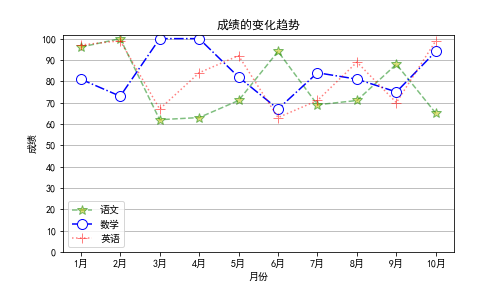
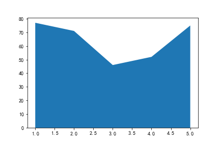

####   强大的数据分析可视化工具


#### 一、 Matplotlib介绍


##### 安装

- anaconda环境: 
  - 自带matplotlib, 无需另外安装

- 其他Python环境: 
  - pip install matplotlib -i https://pypi.tuna.tsinghua.edu.cn/simple

##### 课程介绍

- Matplotlib 是 Python 中最受欢迎的数据可视化软件包之一，支持跨平台运行，它是 Python 常用的 2D 绘图库，同时它也提供了一部分 3D 绘图接口, Matplotlib 通常与 NumPy、Pandas 一起使用，是数据分析中不可或缺的重要工具之一
- 在数据分析和机器学习中, 我们经常要用到大量的可视化操作, 一张制作精美的图片, 可以直观展示数据信息, 字不如表, 表不如图, 一图胜千言.
- 通过 Matplotlib, 我们可以仅需要几行代码，便可以生成图表，直方图，条形图，箱型图，散点图等
- Matplotlib官方网站: https://matplotlib.org/

- 导包

  ```python
  import numpy as np
  import pandas as pd
  import matplotlib.pyplot as plt
  ```

  

#### 二、Matplotlib基本图形绘制

##### 导包

```python
import numpy as np
import pandas as pd
import matplotlib.pyplot as plt
```

##### 配置

```python
# 运行时配置参数
# rcParams : runtime configuration Parameters

# 如果浏览器不显示图片，就需要加上这句话
%matplotlib inline  

# 让图片中可以显示中文
plt.rcParams['font.sans-serif'] = 'SimHei'   
# 让图片中可以显示负号
plt.rcParams['axes.unicode_minus'] = False  

# 支持svg矢量图
%config Inlinebackend.figure_format = 'svg'  

# 查看自己电脑上的字体库
from matplotlib.font_manager import FontManager
fm = FontManager()
my_fonts = set(f.name for f in fm.ttflist)
my_fonts
```


##### 绘制基本图形

- plt.plot()

 

##### 

```python
# 绘制抛物线
x = np.linspace(-5, 5, 50)
y =  x**2

# 画线形图
plt.plot(x, y)
```

##### 样式和颜色

- 样式： '-'，'--'，'-.'，':'，'.'，','，，o，^，v，<，>，s，+，x，D，d，1，2，3，4，h，H，p，| ，_

- 颜色： b(蓝色)，g(绿色)，r(红色)，c(青色)，m(品红)，y(黄色)，k(黑色)，w(白色)


```python
# 绘制抛物线
x = np.linspace(-5, 5, 50)
y =  x**2
plt.plot(x, y, 'r--')
```

##### 画布配置

- plt.figure()


```python
# 画布配置
# figsize: 画布大小，宽高
# dpi ：分辨率
# facecolor: 背景颜色
fig = plt.figure(figsize=(6, 4), dpi=100, facecolor='#11aa11')

# 绘制正弦曲线
x = np.linspace(0, 2*np.pi) 
y = np.sin(x)   
plt.plot(x,y)

# 设置网格线
plt.grid() 
```

##### 在一个画布上绘制多个图


```python
x = np.linspace(0, 8) 

plt.plot(x, np.sin(x))
plt.plot(x, np.cos(x), 'r')
plt.plot(x, -np.sin(x), 'g--')
```

##### 立刻显示图片 

- show


```python
x = np.linspace(0, 8) 
plt.plot(x, np.sin(x))
plt.show() 

plt.plot(x, np.cos(x), 'r')
plt.plot(x, -np.sin(x), 'g--')
```


#### 三、Matplotlib多图布局

- 均匀分布
  - subplot()函数:


```python
# 2行2列
fig = plt.figure(figsize=(8, 5))

x = np.linspace(-np.pi, np.pi, 30)
y = np.sin(x)

# 子图1
axes1 = plt.subplot(221)  # 2行2列的第1个子视图
axes1.plot(x, y)
axes1.set_title('子图1')

# 子图2
axes2 = plt.subplot(222)  # 2行2列的第2个子视图
axes2.plot(x, y)
axes2.set_title('子图2')

# 子图3
axes3 = plt.subplot(2, 2, 3)  # 2行2列的第3个子视图
axes3.plot(x, y)
axes3.set_title('子图3')

# 子图4
axes4 = plt.subplot(2, 2, 4)  # 2行2列的第4个子视图
axes4.plot(x, y)
axes4.set_title('子图4')

# 自动调整布局
fig.tight_layout()
```

- 不均匀分布
  - subplot()函数 


```python
plt.figure(figsize=(8, 5))

x = np.linspace(-np.pi, np.pi, 30)
y = np.sin(x)

# 子图1
axes1 = plt.subplot(2, 2, 1)  
axes1.plot(x, y, color='red')

# 子图2
axes2 = plt.subplot(2, 2, 2)
lines = axes2.plot(x, y)
lines[0].set_marker('*')   # 点的样式

# 子图3
axes3 = plt.subplot(2, 1, 2)  # 2行1列的第2行
axes3.plot(x, np.sin(x*x))
```

- 图形嵌套 
  - add_subplot()函数 


```python
fig = plt.figure(figsize=(8, 5))

# 使用 add_subplot() 函数
# 图1
axes1 = fig.add_subplot(1, 1, 1)
axes1.plot([1, 3])

# 图2
axes2 = fig.add_subplot(2, 2, 1, facecolor='pink')
axes2.plot([1, 3])
```

- 图形嵌套 
  - 使用 axes() 函数
  - 使用 add_axes() 函数


```python
fig = plt.figure(figsize=(8, 5)) 

# 图1
x = np.linspace(0, 2*np.pi, 30)
y = np.sin(x)
plt.plot(x, y)

# 图2
# [left, bottom, width, height]
axes1 = plt.axes([0.55, 0.55, 0.3, 0.3])  
axes1.plot(x, y, color='g')

# 图3
axes2 = fig.add_axes([0.2, 0.2, 0.25, 0.25]) 
axes2.plot(x, y, color='r')
```

- 均匀布局
  - 使用 subplots() 函数


```python
x = np.linspace(0, 2*np.pi)

# 3行3列
# subplots：一次性返回9个子图
fig, ax = plt.subplots(3, 3)
ax1, ax2, ax3 = ax
ax11, ax12, ax13 = ax1
ax21, ax22, ax23 = ax2
ax31, ax32, ax33 = ax3

# fig来设置画布大小
fig.set_figwidth(8)
fig.set_figheight(5)

ax11.plot(x, np.sin(x))
ax12.plot(x, np.cos(x))
ax13.plot(x, np.tanh(x))
ax21.plot(x, np.tan(x))
ax22.plot(x, np.cosh(x))
ax23.plot(x, np.sinh(x))
ax31.plot(x, np.sin(x) + np.cos(x))
ax32.plot(x, np.sin(x*x) + np.cos(x*x))
ax33.plot(x, np.sin(x)*np.cos(x))

# 自动调整布局
plt.tight_layout()
plt.show()
```

- 双轴显示


```python
plt.figure(figsize=(8, 5))

x = np.linspace(0, 10, 100)

# 图1
axes1 = plt.gca()  # 获取当前轴域
axes1.plot(x, np.exp(x), color='red') 

axes1.set_xlabel('time')  
axes1.set_ylabel('exp', color='red')
axes1.tick_params(axis='y', labelcolor='red') 

# 图2
axes2 = axes1.twinx()  # 和图1共享x轴
axes2.set_ylabel('sin', color='blue')
axes2.plot(x, np.sin(x), color='blue')
axes2.tick_params(axis='y', labelcolor='blue')

plt.tight_layout() 
```


#### 四、Matplotlib绘图属性设置

- 常用函数：

  | Pyplot函数  |           API方法            |              描述              |
  | :---------: | :--------------------------: | :----------------------------: |
  |   text()    |     mpl.axes.Axes.text()     |  在Axes对象的任意位置添加文字  |
  |  xlabel()   |  mpl.axes.Axes.set_xlabel()  |         为X轴添加标签          |
  |  ylabel()   |  mpl.axes.Axes.set_ylabel()  |         为Y轴添加标签          |
  |   title()   |  mpl.axes.Axes.set_title()   |       为Axes对象添加标题       |
  |  legend()   |    mpl.axes.Axes.legend()    |       为Axes对象添加图例       |
  | annnotate() |   mpl.axes.Axes.annotate()   | 为Axes对象添加注释（箭头可选） |
  | suptitle()  | mpl.figure.Figure.suptitle() |  为Figure对象添加中心化的标题  |

-  图例
  
  - legend()


```python
# 图形绘制
fig = plt.figure(figsize=(8, 5))

x = np.linspace(0, 2*np.pi) 
plt.plot(x, np.sin(x) )  # 正弦曲线
plt.plot(x, np.cos(x))  # 余弦曲线

# 图例
plt.legend(['Sin','Cos'], 
           fontsize=18,
           loc='center',  # 居中
           ncol=2,  # 显示成几列
           bbox_to_anchor=[0, 1.05, 1, 0.2]  # 图例的位置
          )
```

#####  线条属性
- color 颜色
- linestyle 样式
- linewidth 宽度
- alpha 透明度
- marker 标记

- mfc: marker face color 标记的背景颜色


```python
fig = plt.figure(figsize=(8, 5))
x = np.linspace(0, 2*np.pi, 20)
y1 = np.sin(x)
y2 = np.cos(x)

# c : color 线颜色
# marker: 标记的样式或点的样式
# mfc: marker face color 标记的背景颜色
# ls : line style 线的样式
# lw: line width 线的宽度
# label: 线标签（图例中显示）
plt.plot(x, y1, c='r', marker='o', ls='--', lw=1, label='sinx', mfc='y', )

plt.plot(x, y2, c='b', marker='*', ls='-', lw=2, label='cosx', mfc='g', )

plt.plot(x, y1-y2, c='y', marker='^', ls='-', lw=3, label='sinx-cosx', mfc='b', alpha=0.5)

plt.plot(x, y1+y2, c='orange', marker='>', ls='-.', lw=4, label='sinx+cosx', 
         mfc='y', 
         markersize=10,  # 点大小
         markeredgecolor='green',  #点边缘颜色
         markeredgewidth=2  # 点边缘宽度
        )

# 图例
plt.legend()
```

```python
# **Line Styles**
# =============    ===============================
# character        description
# =============    ===============================
# ``'-'``          solid line style
# ``'--'``         dashed line style
# ``'-.'``         dash-dot line style
# ``':'``          dotted line style
# =============    ===============================

# **Colors**
# The supported color abbreviations are the single letter codes
# =============    ===============================
# character        color
# =============    ===============================
# ``'b'``          blue
# ``'g'``          green
# ``'r'``          red
# ``'c'``          cyan
# ``'m'``          magenta
# ``'y'``          yellow
# ``'k'``          black
# ``'w'``          white
# =============    ===============================

# **Markers**
# =============   ===============================
# character       description
# =============   ===============================
# ``'.'``         point marker
# ``','``         pixel marker
# ``'o'``         circle marker
# ``'v'``         triangle_down marker
# ``'^'``         triangle_up marker
# ``'<'``         triangle_left marker
# ``'>'``         triangle_right marker
# ``'1'``         tri_down marker
# ``'2'``         tri_up marker
# ``'3'``         tri_left marker
# ``'4'``         tri_right marker
# ``'8'``         octagon marker
# ``'s'``         square marker
# ``'p'``         pentagon marker
# ``'P'``         plus (filled) marker
# ``'*'``         star marker
# ``'h'``         hexagon1 marker
# ``'H'``         hexagon2 marker
# ``'+'``         plus marker
# ``'x'``         x marker
# ``'X'``         x (filled) marker
# ``'D'``         diamond marker
# ``'d'``         thin_diamond marker
# ``'|'``         vline marker
# ``'_'``         hline marker
# =============   ===============================
```

##### 坐标轴刻度

- xticks
- yticks


```python
# 图形绘制
x = np.linspace(0, 10) 
y = np.sin(x)   
plt.plot(x,y)

# 设置x轴y轴刻度
plt.xticks(np.arange(0, 11, 1))
plt.yticks([-1, 0, 1])
plt.show()
```


```python
# 图形绘制
x = np.linspace(0, 10) 
y = np.sin(x)   
plt.plot(x,y)

# 设置x轴y轴刻度标签
plt.yticks(ticks=[-1, 0, 1],    # 刻度值
               labels=['min', '0', 'max'],  # 刻度值对应的标签名（显示）
               fontsize=20,   # 文字大小
               ha='right',  # 水平对齐方式
               color='blue'  # 颜色
          )
plt.xticks(ticks=np.arange(0, 11, 1), fontsize=20, color='red' )
plt.show()
```

##### 坐标轴范围[¶](http://localhost:8888/notebooks/资料/代码/03_Matplotlib绘图属性设置.ipynb#坐标轴范围)

- xlim
- ylim


```python
# sin曲线
x = np.linspace(0, 2*np.pi)
y = np.sin(x)
plt.plot(x, y, c='r')

# 设置x轴范围
plt.xlim(-2, 8)

# # 设置 y轴范围
plt.ylim(-2, 2)
```

##### 坐标轴配置

- axis


```python
# sin曲线
x = np.linspace(0, 2*np.pi)
y = np.sin(x)
plt.plot(x, y, c='r')

# 坐标轴范围：[xmin, xmax, ymin, ymax]
plt.axis([-2, 8, -2, 2])

# 选项
# off ： 不显示坐标轴
# equal: 让x轴和y轴 刻度距离相等
# scaled：自动缩放坐标轴和图片适配
# tight：紧凑型自动适配图片
# square：x轴和y轴宽高相同
plt.axis('square')

plt.show()
```


##### 标题 和 网格

- title
- grid


```python
# 图形绘制
x = np.linspace(0, 10) 
y = np.sin(x)   
plt.plot(x, y)

# 图的标题
# fontsize : 标题大小
# loc：标题位置
plt.title('sin曲线', fontsize=20, loc='center')
# 父标题
plt.suptitle('父标题', 
             y=1.1,  # 位置
             fontsize=30 #文字大小
            )  

# 网格线
# ls: line style 网格线样式
# lw：line width  网格线宽度
# c: color 网格线颜色
# axis：画哪个轴的网格线，默认x轴和y轴都画
plt.grid(ls='--', lw=0.5, c='gray', axis='y')

plt.show()
```

##### 标签

- xlabel
- ylabel


```python
# 图形绘制
x = np.linspace(0, 10) 
y = np.sin(x)   
plt.plot(x, y)

# 坐标轴标签
plt.xlabel('y=sin(x)', 
               fontsize=20,   # 文字大小
               rotation=0,  # 旋转角度
          )
plt.ylabel('y=sin(x)', 
            rotation=90,  # 旋转角度
            horizontalalignment='right',   # 水平对齐方式
            fontsize=20 
          )

# 标题
plt.title('正弦曲线')
```

##### 文本

- text


```python
plt.figure(figsize=(8, 5))

x = np.linspace(0, 10, 10)
y = np.array([60, 30, 20, 90, 40, 60, 50, 80, 70, 30])
plt.plot(x, y, ls='--', marker='o')

# 文字
for a, b in zip(x, y):
    # 画文本
    plt.text(
            x=a+0.3,  # x坐标
            y=b+0.5,  # y坐标
            s=b,  # 文字内容
            ha='center',  # 水平居中
            va='center',   # 垂直居中
            fontsize=14,  # 文字大小
            color='r'  # 文字颜色
    )
    
plt.show()
```

##### 注释

- annotate 


```python
plt.figure(figsize=(8, 5))

x = np.linspace(0, 10, 10)
y = np.array([60, 30, 20, 90, 40, 60, 50, 80, 70, 30])
plt.plot(x, y, ls='--', marker='o')

# 注释（标注）
plt.annotate(
    text='最高销量',  # 标注的内容
    xy=(3, 90),  # 标注的坐标点
    xytext=(1, 80),  # 标注的内容的坐标点
    # 箭头样式
    arrowprops={
                'width': 2,   # 箭头线的宽度 
                'headwidth': 8,  # 箭头头部的宽度
                'facecolor': 'blue'  # 箭头的背景颜色
    }
)
```

##### 保存图片

- savefig 


```python
# 图形绘制
f = plt.figure(figsize=(8, 5))

x = np.linspace(0, 2*np.pi) 
plt.plot(x, np.sin(x) )
plt.plot(x, np.cos(x)) 

f.savefig(
            fname='pic_name2.png',  # 文件名：png、jpg、pdf
            dpi=100,  # 保存图片像素密度
            facecolor='pink',  # 背景颜色
            edgecolor='lightgreen',  # 边界颜色
            bbox_inches='tight',  # 保存图片完整
            pad_inches=1  # 内边距
)  
```


#### 五、Matplotlib常用视图


##### 折线图

折线图（line chart）是我们日常工作、学习中经常使用的一种图表，它可以直观的反映数据的变化趋势

- 一次画一条线


```python
plt.figure(figsize=(8, 5))

x = ["Mon", "Tues", "Wed", "Thur", "Fri","Sat","Sun"]
y = [20, 40, 35, 55, 42, 80, 50]

plt.plot(x, y, c="g", marker='D', markersize=5)

#绘制坐标轴标签
plt.xlabel("星期")
plt.ylabel("活跃度")
plt.title("Python语言活跃度")

for x1, y1 in zip(x, y):
    plt.text(x1, y1, str(y1), ha='center', va='bottom', fontsize=16)

plt.show()
```

- 一次画多条线


```python
plt.figure(figsize=(8, 5))

x = np.random.randint(0, 10, size=15)

plt.plot(x, marker='*', color='r')
plt.plot(x.cumsum(), marker='o')
```

- 统计各科成绩变化趋势



```python
df = pd.read_excel('data/plot.xlsx', sheet_name='line')
df.head()

x, y1, y2, y3 = df['月份'], df['语文'], df['数学'], df['英语']

# 画折线图
# 画布大小
plt.figure(figsize=(7, 4))

# ms: marker size 标记点的大小
# alpha: 透明度 0~1之间，1表式不透明，0表式完全透明
plt.plot(x, y1, label='语文', c='g', ls='--', marker='*', mfc='y', ms=10, alpha=0.5)
plt.plot(x, y2, label='数学', c='b', ls='-.', marker='o', mfc='w', ms=10)
plt.plot(x, y3, label='英语', c='r', ls=':', marker='+', mfc='w', ms=10, alpha=0.5)

plt.yticks(range(0, 110, 10))  # y轴的刻度
plt.ylabel('成绩')
plt.xlabel('月份')
plt.title('成绩的变化趋势')

plt.legend()  # 图例
plt.grid(axis='y')
plt.show()
```


##### 柱状图和条形图

柱状图是一种用矩形柱来表示数据分类的图表，柱状图可以垂直绘制，也可以水平绘制，它的高度与其所表示的数值成正比关系

- 简单柱状图


```python
fig = plt.figure(figsize=(8, 5))

x = ['语文', '数学',  '英语', 'Python', '化学']
y = [20, 10, 40, 60, 10]

plt.bar(x, y)
plt.show()
```

- 统计年销量数据可视化


```python
df = pd.read_excel('data/plot.xlsx', sheet_name='bar1')

x, y = df.年份, df.销售额

plt.figure(dpi=100)
plt.title('2014年-2020年销售额')
plt.xlabel('年份')
plt.ylabel('销售额')

# 柱形图
plt.bar(x, y, width=0.6)

# 给每个柱形图加上数字
for a, b in zip(x, y):
    plt.text(x=a, y=b+5e4, s='{:.1f}万'.format(b/10000), 
                ha='center', fontsize=9
            )
plt.show()
```

- 簇状柱形图


```python
df2 = pd.read_excel('data/plot.xlsx', sheet_name='bar2')
x, y1, y2, y3 = df2.年份,  df2.北区, df2.中区, df2.南区

plt.figure(dpi=100)
plt.title('2014年-2020年销售额')
plt.xlabel('年份')
plt.ylabel('销售额')

width=0.2
plt.bar(x-width, y1, width=width, label='北区')
plt.bar(x, y2, width=width, label='中区')
plt.bar(x+width, y3, width=width, label='南区')

plt.legend()
plt.show()
```

- 堆叠柱形图 


```python
plt.figure(dpi=100)
plt.title('2014年-2020年销售额')
plt.xlabel('年份')
plt.ylabel('销售额')

plt.bar(x, y1, label='北区')
plt.bar(x, y2, label='中区', bottom=y1)  # 画图的时候y轴的底部起始值
plt.bar(x, y3, label='南区', bottom=y1+y2)

plt.legend()
plt.show()
```

- 条形图 


```python
# 条形图
plt.barh(x, y1)
```


##### 直方图

直方图（Histogram），又称质量分布图，它是一种条形图的一种，由一系列高度不等的纵向线段来表示数据分布的情况。 直方图的横轴表示数据类型，纵轴表示分布情况。

直方图用于概率分布，它显示了一组数值序列在给定的数值范围内出现的概率；而柱状图则用于展示各个类别的频数。

- 简单的直方图


```python
x = np.random.randint(0, 10, 100)
pd.Series(x).value_counts()
# 直方图
# bins: 组数
plt.hist(x, bins=5)
plt.hist(x, bins=[0, 3, 6, 9, 10])
```

- 学生成绩分布情况


```python
df = pd.read_excel('data/plot.xlsx', sheet_name='hist')
x = df['分数']

x.min(), x.max()

# 直方图
# edgecolor: 边缘颜色
plt.hist(x, bins=range(40, 110, 6), facecolor='b', edgecolor='k', alpha=0.4)

plt.show()
```


##### 箱型图

箱型图（也称为盒须图）它能显示出一组数据的最大值、最小值、中位数、及上下四分位数。


- 箱型图 


```python
x = [1, 2, 3, 5, 7, 9, -10]

# 箱型图
plt.boxplot(x)
plt.show()

# 最大值
# 3/4
# 中位数
# 1/4
# 最小值

# 异常值
```

- 一次画多个箱型图 


```python
x1 = np.random.randint(10, 100, 100)
x2 = np.random.randint(10, 100, 100)
x3 = np.random.randint(10, 100, 100)

plt.boxplot([x1, x2, x3])
plt.show()
```

- 箱型图样式 


```python
data=np.random.normal(size=(500, 4)) 
lables = ['A','B','C','D']

# 画图
plt.boxplot(data, 
            notch=True,   # 箱型图样式
            sym='go',  # 颜色+marker样式
            labels=lables  # x轴标签
)  
plt.show()
```


##### 散点图

散点图用于在水平轴和垂直轴上绘制数据点，它表示了因变量随自变量变化的趋势。通俗地讲，它反映的是一个变量受另一个变量的影响程度

- 散点图 


```python
x = range(1, 7, 1)
y = range(10, 70, 10)

# 散点图
plt.scatter(x, y, marker='o')
```

- 气泡图 


```python
data = np.random.randn(100, 2)
s = np.random.randint(50, 200, size=100)
color = np.random.randn(100)

plt.scatter(
            data[:, 0],  # x坐标
            data[:, 1],  # y坐标
            s=s,  # 尺寸
            c=color,  # 颜色
            alpha=0.6  # 透明度
) 
```

- 广告费用与销售收入之间的关系分析 


```python
df = pd.read_excel('data/plot.xlsx', sheet_name='scatter')
x, y = df['广告费用'], df['销售收入']

plt.figure(dpi=100)
plt.scatter(x, y)

plt.title('广告费用和销售收入之间的关系')
plt.xlabel('广告费用')
plt.ylabel('销售收入')
```

- 六边形图


```python
plt.figure(dpi=100)

# 六边形图
# gridsize: 网格大小
# cmap: color map 颜色映射
#      rainbow: 彩虹色
plt.hexbin(x, y, gridsize=20, cmap="rainbow")

plt.title('广告费用和销售收入之间的关系')
plt.xlabel('广告费用')
plt.ylabel('销售收入')
```

#### 

##### 饼图

饼状图用来显示一个数据系列，具体来说，饼状图显示一个数据系列中各项目的占项目总和的百分比。

- 饼图


```python
x = [10, 20, 30, 40]

plt.pie(x, autopct='%.1f%%')
plt.show()
```

- 各省份销量占比


```python
df = pd.read_excel('data/plot.xlsx', sheet_name='pie1')
citys, values = df.省份, df.销量

# 饼图
plt.figure(figsize=(5, 5))
plt.pie(
            x=values,   # 值
            autopct='%.1f%%',  # 百分比
            labels=citys,  # 标签
            pctdistance=0.8,  # 百分比文字的位置
            explode=[0, 0, 0, 0.1, 0, 0.1, 0, 0, 0, 0],  # 分裂效果
            # 字体样式
            textprops={'fontsize': 12, 'color': 'blue'},
            shadow=True
       )

plt.show()
```

- 单个圆环: 甜甜圈


```python
# 饼图
plt.pie(
            x=values,   # 值
            autopct='%.1f%%',  # 百分比
            labels=citys,  # 标签
            pctdistance=0.8,  # 百分比文字的位置
            # 字体样式
            textprops={'fontsize': 10, 'color': 'k'},
            
            # 甜甜圈设置
            wedgeprops={'width': 0.4, 'edgecolor': 'w'}
       )

plt.show()
```

- 多个圆环


```python
df1 = pd.read_excel('data/plot.xlsx', sheet_name='pie1')
df2 = pd.read_excel('data/plot.xlsx', sheet_name='pie2')

citys1, values1 = df1.省份, df1.销量
citys2, values2 = df2.省份, df2.销量

plt.figure(dpi=200)

# 饼图
plt.pie(
            x=values1,   # 值
            autopct='%.1f%%',  # 百分比
            labels=citys1,  # 标签
            pctdistance=0.8,  # 百分比文字的位置
            # 字体样式
            textprops={'fontsize': 10, 'color': 'k'},
            
            # 
            wedgeprops={'width': 0.4, 'edgecolor': 'w'}
       )

# 饼图
plt.pie(
            x=values2,   # 值
            autopct='%.1f%%',  # 百分比
           #  labels=citys2,  # 标签
            pctdistance=0.8,  # 百分比文字的位置
            # 字体样式
            textprops={'fontsize': 8, 'color': 'k'},
            # 半径 
            radius=0.6
       ) 

plt.legend(citys1, fontsize=3)

plt.show()
```


##### 面积图

面积图又称区域图，和折线图差不多，强调y轴随x轴而变化的程度，可用于引起人们对总值趋势的注意

- 面积图



```python
x = [1, 2, 3, 4, 5]
y = np.random.randint(10, 100, 5)

# 面积图
plt.stackplot(x, y)
```

- 销售额趋势


```python
df = pd.read_excel('data/plot.xlsx', sheet_name='stackplot1')
x, y = df['年份'], df['销售额']

plt.figure(dpi=100)
plt.stackplot(x, y)
plt.plot(x, y)
```


##### 热力图

热力图是一种通过对色块着色来显示数据的统计图表。绘图时，需指定颜色映射的规则。

- 热力图


```python
df = pd.read_excel('data/plot.xlsx', sheet_name='imshow')
data = df.drop(columns='省份').values
y = df['省份']
# x = df.columns[1:]
x = df.drop(columns='省份').columns

plt.figure(figsize=(14, 10))

# 热力图
plt.imshow(data, cmap='Blues')

# 设置坐标轴刻度
plt.xticks(range(len(x)), x)
plt.yticks(range(len(y)), y)

# 添加文字
for i in range(len(x)):
    for j in range(len(y)): 
        plt.text(x=i, y=j, s=data[j, i], 
                 ha='center', 
                 va='center',
                fontsize=12
                )
    
# 颜色条
plt.colorbar()
plt.show()
```

#### 

##### 极坐标图

极坐标系是一个二维坐标系统,该坐标系统中任意位置可由一个夹角和一段相对原点—极点的距离来表示

- 极坐标图


```python
N = 8  # 分成8份

x = np.linspace(0,  2*np.pi, N, endpoint=False)   # 360度等分成8份
height = np.random.randint(3, 15, size=N)  # 值

width = np.pi / 4  # 宽度
colors = np.random.rand(8, 3)  # 随机颜色

# polar表示极坐标
ax = plt.subplot(111,  projection='polar') 
ax.bar(x=x, height=height, width=width, bottom=0, color=colors)
plt.show()
```


##### 雷达图

雷达图是以从同一点开始的轴上表示的三个或更多个定量变量的二维图表的形式显示多变量数据的图形方法

- 雷达图


```python
fig = plt.figure(figsize=(6, 6))

x = np.linspace(0, 2*np.pi, 6, endpoint=False)
y = [83, 61, 95, 67, 76, 88]

# 保证首位相连
x = np.concatenate((x, [x[0]]))
y = np.concatenate((y, [y[0]]))

# 雷达图
axes = plt.subplot(111, polar=True)   

axes.plot(x, y, 'o-', linewidth=2)  # 连线
axes.fill(x, y, alpha=0.3)  # 填充

# 显示刻度
axes.set_rgrids([20, 40, 60, 80], fontsize=14)
plt.show()
```


##### 等高线图

- 等高线图：也称水平图，是一种在二维平面上显示 3D 图像的方法


```python
x = np.linspace(-5, 5, 100)
y = np.linspace(-5, 5, 100)

# 将上述数据变成网格数据形式
X, Y = np.meshgrid(x, y)

# 定义Z与X, Y之间的关系
Z = np.sqrt(X**2 + Y**2)

# 画等高线
cp = plt.contourf(X, Y, Z)
# 颜色柱
plt.colorbar(cp) 
plt.show()
```


#### 六、Matplotlib 3D图

- 三维折线图 


```python
# 3D引擎
from mpl_toolkits.mplot3d.axes3d import Axes3D 

fig = plt.figure(figsize=(8, 5))  

x = np.linspace(0, 100, 400)
y = np.sin(x)
z = np.cos(x)

# 三维折线图
axes = Axes3D(fig, auto_add_to_figure=False) 
fig.add_axes(axes)
axes.plot(x,y,z) 
```

- 三维散点图


```python
from mpl_toolkits.mplot3d.axes3d import Axes3D 

fig = plt.figure(figsize=(8, 5))  

# 三维折线图
axes = Axes3D(fig, auto_add_to_figure=False) 
fig.add_axes(axes)

# 三维散点图
x = np.random.rand(50)  
y = np.random.rand(50)  
z = np.random.rand(50) 
axes.scatter(x, y, z, color='red', s=100)
```

- 三维柱形图


```python
from mpl_toolkits.mplot3d.axes3d import Axes3D 

fig = plt.figure(figsize=(8, 5))

# 二维变成了三维
axes = Axes3D(fig, auto_add_to_figure=False) 
fig.add_axes(axes)

x = np.arange(1, 5)

for m in x:
    axes.bar(
            np.arange(4),
            np.random.randint(10, 100, size=4),
            zs=m,  # 在x轴中的第几个
            zdir='x',  # 在哪个方向上排列
            alpha=0.7,  # 透明度
            width=0.5  # 宽度
    )
    
axes.set_xlabel('X轴', fontsize=18, color='red')
axes.set_ylabel('Y轴', fontsize=18, color='blue')
axes.set_zlabel('Z轴', fontsize=18, color='green')
plt.show()
```


#### 七、Matplotlib 图像处理

- 读取图片

```python
img = plt.imread('data/pandas.jpeg')
img
```

- 显示图片


```python
# 显示图片
plt.imshow(img)
```

- 垂直翻转


```python
# 垂直翻转显示
plt.imshow(img, origin='lower')
# 或
plt.imshow(img[::-1])
```

- 水平翻转


```python
# 水平翻转
plt.imshow(img[:, ::-1])
```

- 保存图片

```python
# 保存图片
plt.imsave('images/pandas.png', img)
```


#### 八、Matplotlib-科比投篮数据可视化项目


##### 读取数据

```python
# 读取科比投篮数据
df = pd.read_csv('data/kobe.csv')
df.shape
df.head()
```

##### 1. 分别根据投篮点坐标(loc_x, loc_y) 和 投篮经纬度(lat, lon)画出科比投篮的位置
- (2个散点图， 使用子图)

```python
plt.figure(figsize=(8*2,  8))

axes1 = plt.subplot(1, 2, 1)
axes1.scatter(df['loc_x'], df['loc_y'])
axes1.set_title('投篮点坐标', fontsize=12)

axes2 = plt.subplot(1, 2, 2)
axes2.scatter(df['lat'] , df['lon'])
axes2.set_title('投篮经纬度', fontsize=12)
plt.show()
```


##### 2. 画图对比科比的出手方式action_type的次数,得出科比哪种出手方式最多

- 使用条形图
- 画图显示前10个即可

```python
df['action_type'].value_counts().head(10)[::-1].plot.barh(figsize=(8, 4))
```


##### 3. 科比各种投篮方式命中率 可视化对比

- combined_shot_type 投篮方式 

```python
# 每一种投篮方式 命中次数
action_type_sum = df.groupby('combined_shot_type')['shot_made_flag'].sum() 
# 每一种投篮方式 投篮总次数
action_type_count = df.groupby('combined_shot_type')['shot_made_flag'].count() 

action_type_rate = action_type_sum / action_type_count
action_type_rate.plot()
action_type_rate.plot.bar()
```


##### 4. 科比在各区域投篮对比

- 画散点图，并使用cmap="rainbow"区分颜色
- 画3个子图： shot_zone_basic， shot_zone_range， shot_zone_area

```python
# 将字符串量化
df['shot_zone_area'] = df['shot_zone_area'].factorize()[0]
df['shot_zone_range'] = df['shot_zone_range'].factorize()[0]
df['shot_zone_basic'] = df['shot_zone_basic'].factorize()[0]

# 画3个子图
plt.figure(figsize=(4*3,  4))
N = ['shot_zone_basic', 'shot_zone_range', 'shot_zone_area']
for k in range(3):

    axes = plt.subplot(1, 3, k+1)
    axes.scatter(df['loc_x'], df['loc_y'], c=df[N[k]], cmap='rainbow')
    axes.set_title(N[k], fontsize=20)
```


##### 5. 科比在每一节的出手次数对比

- 柱形图 

```python
df.groupby('period')['period'].count().plot.bar()
plt.show()
```


